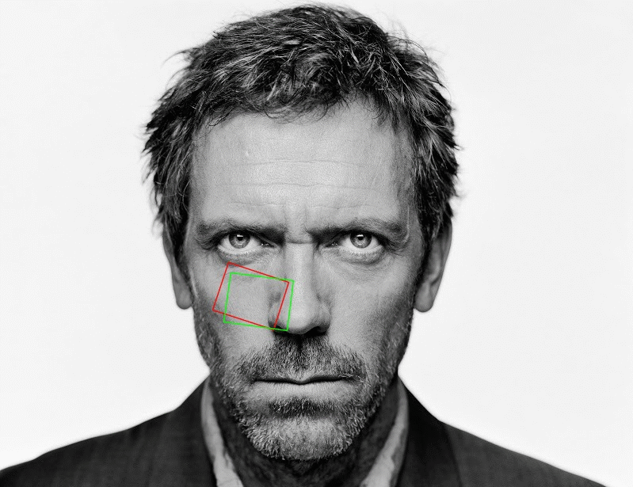

# About this library

**Image Align** is a C++ library providing variants of the classic image alignment algorithm by Lucas-Kanade.



The project emerged while working on [AAM](https://www.github.com/cheind/aam), an active appearance models library. Fitting active appearance models is
similar to the classic image alignment problem: 

> The goal of image alignment is to find the locally 'best' transform between a template image and a target image by minimizing an energy function measuring the fitness of the alignment. -- <cite>Ian Matthews</cite>

# Algorithms and Features

All image alignment algorithms implemented in this library are based on the original formulation of [Lucas-Kanade](#Lucas81):

 - Forward additive algorithm
 - Forward compositional algorithm
 - Inverse compositional algorithm

For convergence and runtime reasons all algorithms support **multi-level hierarchical** matching.

The alignment algorithms are independent of the chosen warp function. Currently the library provides the following warp modes:

 - 2D Translational Warp
 - 2D Euclidean Warp 
 - 2D Similarity Warp
 - 2D Affine Warp

User defined warp functions can be easily added. 

# Usage

**Image Align** is quite simple to use. Start by including the necessary headers

```C++
#include <imagealign/imagealign.h>
```

Next, declare the type of warp and alignment strategy you wish to use

```C++
namespace ia = imagealign;

const int WarpMode = ia::WARP_SIMILARITY;

typedef ia::Warp<WarpMode> WarpType;
typedef ia::AlignInverseCompositional<WarpMode> AlignType;
```

Given a template image and a target image you can now perform alignment

```C++

cv::Mat tpl;    // The template image
cv::Mat target; // The target image

namespace ia = imagealign;

// Instance necessary objects
WarpType w;
AlignType a;

// Prepare for alignment using 3 levels of hierarchy
a.prepare(tpl, target, 3);

// Align
int maxIterationsPerLevel[] = {30, 30, 15};
a.align(w, iterationsPerLevel);
```

When alignment has finished, ``w`` will hold the warp that best aligns the template image with the target image. 

Please note, Lucas-Kanade methods are locally operating methods that require a good guess of true warp parameters to converge. To provide a guess, simple adjust the parameters of ``w`` using methods such as ``w.setParameters()`` and similar before calling ``a.align()``.

**Image Align** comes with a couple of examples that illustrate further usage. you can find these in the [examples directory](examples/). Additionally [these unit tests](tests/) might provide in-depth information.

# Building from source
**Image Alignment** requires the following pre-requisites

 - [CMake](www.cmake.org) - for generating cross platform build files
 - [OpenCV](www.opencv.org) - for image processing related functions 
 
To build from source

 1. Point CMake to the cloned git repository
 1. Click CMake Configure
 1. Point `OpenCV_DIR` to the directory containing the file `OpenCVConfig.cmake`
 1. Click CMake Generate
 
Although **Image Alignment** should build across multiple platforms and architectures, tests are carried out on these systems
 - Windows 8/10 MSVC10 x86
 - OS X 10.10 XCode 7.x

If the build should fail for a specific platform, don't hesitate to create an issue. 

# References

 1. <a name="Lucas81"></a>Lucas, Bruce D., and Takeo Kanade. "An iterative image registration technique with an application to stereo vision." IJCAI. Vol. 81. 1981.
 2. <a name="Baker01"></a>Baker, Simon, and Iain Matthews. "Equivalence and efficiency of image alignment algorithms." Computer Vision and Pattern Recognition, 2001. CVPR 2001. Proceedings of the 2001 IEEE Computer Society Conference on. Vol. 1. IEEE, 2001.
 3. <a name="Baker02"></a>Baker, Simon, and Iain Matthews. Lucas-Kanade 20 years on: A unifying framework: Part 1. Technical Report CMU-RI-TR-02-16, Carnegie Mellon University Robotics Institute, 2002.
 4. <a name="Baker03"></a>Baker, Simon, and Iain Matthews. Lucas-Kanade 20 years on: A unifying framework: Part 2. Technical Report CMU-RI-TR-03-01, Carnegie Mellon University Robotics Institute, 2003.
 4. <a name="Baker04"></a>Baker, Simon, et al. "Lucas-Kanade 20 years on: A unifying framework: Part 3." The Robotics Institute, Carnegie Mellon University (2003).

# License
```
This file is part of Image Alignment.

Copyright Christoph Heindl 2015

Image Alignment is free software: you can redistribute it and/or modify
it under the terms of the GNU General Public License as published by
the Free Software Foundation, either version 3 of the License, or
(at your option) any later version.

Image Alignment is distributed in the hope that it will be useful,
but WITHOUT ANY WARRANTY; without even the implied warranty of
MERCHANTABILITY or FITNESS FOR A PARTICULAR PURPOSE.  See the
GNU General Public License for more details.

You should have received a copy of the GNU General Public License
along with Image Alignment.  If not, see <http://www.gnu.org/licenses/>.
```
